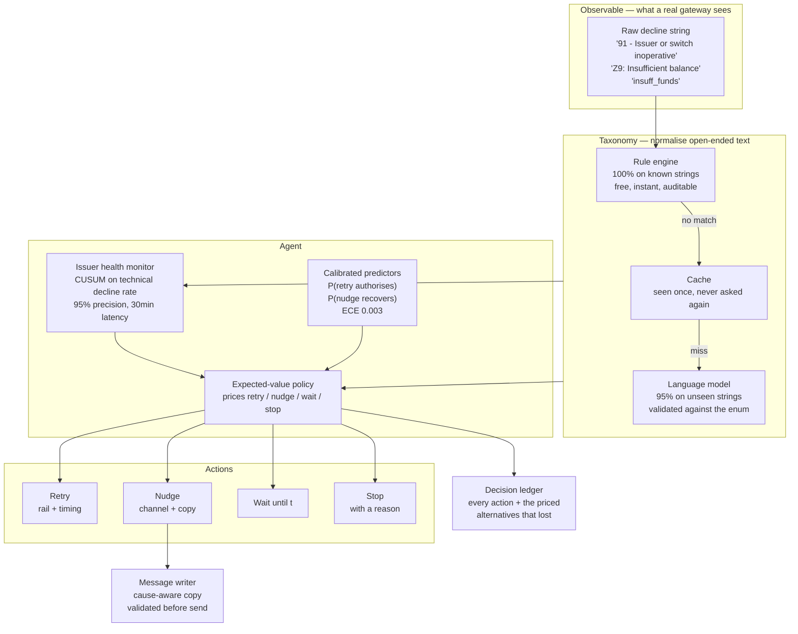

# Kintsugi — System Architecture

## The problem

A failed payment is not a dead transaction. It is a decision problem that most
systems solve with a `for` loop.

The industry default is to retry at fixed offsets — an hour, a day, three days —
and send a fixed sequence of reminders, with no reference to *why* the payment
failed. That is not stupid; it recovers real money. It is blind. It retries
closed accounts. It messages customers at 3am. It hammers an account that has no
balance on the 28th and gives up before payday on the 1st. And it keeps
retrying into a bank that is currently down.

Kintsugi treats each open payment as a sequential decision under uncertainty:
given what we know, what is the most valuable thing to do about this claim, and
is *now* the moment to do it?

## The decision

Every action is priced in rupees and the largest wins:

```
EV(retry on rail r)   = P(authorises now | cause, time, rail, issuer) × amount − attempt cost
EV(nudge on channel c)= P(money arrives  | cause, time, channel)      × amount − send cost − churn risk × amount
EV(wait until t)      = max over actions available at t, discounted for expiry risk
EV(stop)              = 0
```

The critical term is `EV(wait)`. Waiting is a **first-class action evaluated
against future moments**, not a default gap between retries. A fixed schedule
asks "has enough time passed?"; Kintsugi asks "is there a better moment coming,
and is it worth waiting for?" For a balance failure on the 26th, the answer is
usually yes — payday is worth more than any number of retries before it.

## Component map



## Where the language model is — and deliberately is not

**It is used in two places**, both chosen because open-ended natural language is
the thing it is actually better at than a rule table:

1. **Normalising decline strings.** There is no shared decline vocabulary in
   Indian payments. A card decline arrives as ISO 8583 (`"51"`), a UPI decline
   as an NPCI code (`"Z9"`, `"U30"`), and every bank and PSP wraps those in its
   own free text — often truncated, sometimes misspelled, occasionally just
   `"Payment failed"`. New templates ship without notice.
2. **Writing customer-facing copy**, conditioned on the failure cause. A
   customer who is short on balance and one who closed the app before entering
   their PIN need completely different messages, and *"your payment failed,
   please try again"* is wrong for both.

**It does not choose actions.** Deciding which payment to chase is a
calibrated-probability problem against a cost model. A language model asked to
do it produces fluent, confident, *unpriced* guesses — and a fluent wrong answer
is indistinguishable from a right one, so it would misprice retries with no way
to notice. Keeping it out of the decision loop is a design decision, not an
omission.

Both LLM surfaces are **constrained, validated, cached, and optional**:

| | Taxonomy | Messaging |
|---|---|---|
| Output space | 13 known labels | short text |
| Validation | must parse to the enum, else `UNKNOWN` | length, no invented offers/refunds/phone numbers, no unresolved placeholders |
| Caching | per string; vocabularies are small and repetitive | per (cause, channel); 39 combinations total |
| If unavailable | rules only, residue marked `UNKNOWN`, handled conservatively | deterministic template per cause |

The system runs correctly with **no model at all**. A payments component that
stops working when an inference endpoint is down has no business near the
authorisation path.

## Layers

### 1. World (`kintsugi/world/`)

A simulated payments book, because no public dataset of payment *failures*
exists — issuers and PSPs do not publish transaction-level decline data.

Failures are generated **cause-first from latent state**, not sampled from a
static table. Each attempt runs a sequence of gates, and each gate is keyed to
the timescale on which that condition actually changes:

| Gate | Keyed by | So a retry… |
|---|---|---|
| Instrument alive | payment | never helps |
| Issuer healthy | wall-clock health timeline | helps once it recovers |
| Balance sufficient | payment + **day** | helps after payday |
| Within limits | payment + **day** | helps tomorrow |
| Risk accepted | payment + attempt | may help immediately |
| Customer authorises | payment + attempt + hour | helps if well timed |

The keying is the whole point. Because the balance gate is keyed by day,
retrying twenty minutes later draws the *same* value and fails again — as it
would in reality, since no money arrived. Under naive per-attempt sampling a
retry is just another roll of the dice, so any policy that retries more recovers
more, and the evaluation measures persistence rather than intelligence. (The
first version of this simulator had exactly that bug: blind `fixed_retry` beat
the smart rule-based policy 98.9% to 96.8%.)

### 2. Calibration (`kintsugi/calibration.py`, `world/fitting.py`)

Hazard scales are **fitted, not hand-tuned**. Iterative proportional fitting
solves for per-segment scales that reproduce published marginals. Fitting them
per segment rather than globally is what makes the problem well posed — checkout
and mandate debits have different published success rates *and* different cause
mixes, and one shared scale per cause cannot satisfy both.

Every calibration constant carries its provenance — `PUBLISHED`, `DERIVED`, or
`ASSUMPTION` — and the table is emitted into the results, so a reader can audit
exactly how much of the model is evidence and how much is us.

### 3. Agent (`kintsugi/agent/`)

- **Health monitor** — CUSUM change detection on per-issuer *technical decline
  rate*. Not overall success rate: with a meaningful recurring segment, baseline
  failure is ~25% because mandate debits bounce on balance, which swamps the
  outage signal entirely (recall 1.3%). Technical decline separates cleanly —
  0.7% healthy, 11.9% degraded, 49.6% outage. This is also what NPCI publishes
  per bank.
- **Predictors** — gradient-boosted trees, isotonically calibrated. Trained on
  data from *randomised explorer* policies, never from a sensible policy: a
  policy's own logs have no support where it never acts, so a model fitted on
  them would confidently recommend actions whose consequences were never
  observed.
- **Policy** — the EV optimiser above, with terminal causes settled by the
  taxonomy rather than the model. No probability estimate can talk the agent
  into retrying a closed account.

### 4. Evaluation (`kintsugi/eval/`)

Paired comparison under **common random numbers**. For each seed one world is
built and every policy runs against it; because randomness is counter-based, the
k-th attempt on payment *P* resolves against the same underlying draw whichever
policy made it. Policies face the same world payment-by-payment, so the shared
noise cancels.

CRN is easy to break by accident and fails *silently* — the intervals keep
printing as if nothing happened. So the harness asserts it: `verify_crn` checks
that every policy saw byte-identical first attempts on every payment, and the
evaluation refuses to report if that fails.

The sensitivity sweep re-runs the whole comparison with each `ASSUMPTION`
constant moved well above and below its default, including settings actively
hostile to the agent.

## Seed discipline

Nothing is reported on the worlds it was fitted on.

| Purpose | Seeds |
|---|---|
| Predictor training | 2000–2029 |
| Detector threshold tuning | 11–13 |
| Detector reporting | 101–105 |
| Policy evaluation | 1000–1203 |

## Running it

```bash
python -m kintsugi.world.fitting      # refit the world to published marginals
python -m scripts.train_predictor     # train predictors on exploration data
python -m scripts.run_evaluation      # paired evaluation -> data/results.json
python -m scripts.run_sensitivity     # assumption sweep
pytest                                # 53 tests
```

Everything runs on CPU with no paid services. The language model defaults to a
local one via Ollama; a free hosted tier or a paid API is used only if a key is
present, and the system degrades cleanly to rules and templates when none is.
