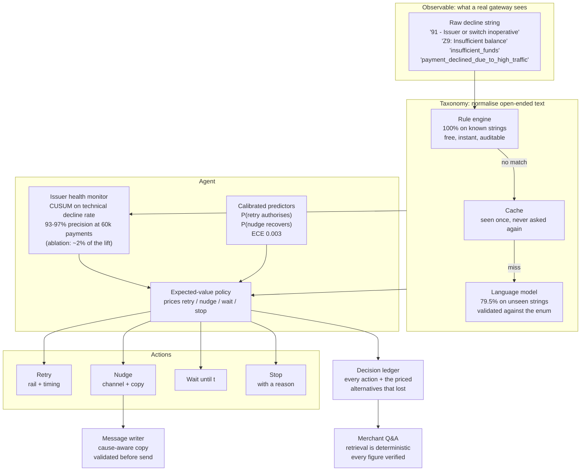

# Kintsugi: architecture

The decision model, the results and the failure log are in
[README.md](README.md). This covers how the pieces fit together and why the
simulated world is built the way it is.

## Component map



## Layers

### 1. World (`kintsugi/world/`)

A simulated payments book, because no public dataset of payment *failures*
exists: issuers and PSPs do not publish transaction-level decline data.

Failures are generated **cause-first from latent state**, not sampled from a
static table. Each attempt runs a sequence of gates, and each gate is keyed to
the timescale on which that condition actually changes:

| Gate | Keyed by | So a retry… |
|---|---|---|
| Instrument alive | payment | never helps |
| Issuer healthy | wall-clock health timeline | helps once it recovers |
| Balance sufficient | payment + **day** | helps after payday |
| Within limits | payment + **day** | helps tomorrow |
| Risk accepted | payment + attempt | may help immediately |
| Customer authorises | payment + attempt + hour | helps if well timed |

One further distinction matters more than it looks: **being able to re-prompt
the payer is not the same as needing them present.** A UPI *collect* request is
merchant-initiated, so a retry pushes a fresh approval request into the payer's
app and genuinely re-prompts. A UPI *intent* payment is payer-initiated: they
tapped Pay and were deep-linked out, and netbanking is a redirect the payer
drives; for those, no server-side retry reaches anyone, and the only way back is
to send the customer a message.

Modelling every customer-present rail as re-promptable made outbound messaging
vestigial: retries were simply cheaper reminders, and the agent's best
configuration sent *zero* messages. That was an artefact of the abstraction, not
a finding about payments, and it was caught only because pricing customer
attention produced a result too clean to believe.

Because two of the gates reset at **midnight**, the feature set carries
explicit calendar-boundary features. Elapsed time cannot express the
distinction: 23:50 → 00:10 is twenty minutes and a completely different day.
Without them the agent retried `LIMIT_EXCEEDED` failures inside the same day,
where a daily limit cannot have reset, and scored 65.9% against the baseline's
92.9%.

The keying is the whole point. Because the balance gate is keyed by day,
retrying twenty minutes later draws the *same* value and fails again — as it
would in reality, since no money arrived. Under naive per-attempt sampling a
retry is just another roll of the dice, so any policy that retries more recovers
more, and the evaluation measures persistence rather than intelligence. (The
first version of this simulator had exactly that bug: blind `fixed_retry` beat
the smart rule-based policy 98.9% to 96.8%.)

### 2. Calibration (`kintsugi/calibration.py`, `world/fitting.py`)

Hazard scales are **fitted, not hand-tuned**. Iterative proportional fitting
solves for per-segment scales that reproduce published marginals. Fitting them
per segment rather than globally is what makes the problem well posed: checkout
and mandate debits have different published success rates *and* different cause
mixes, and one shared scale per cause cannot satisfy both.

Every calibration constant carries its provenance: `PUBLISHED`, `DERIVED`, or
`ASSUMPTION`, and the table is emitted into the results, so a reader can audit
exactly how much of the model is evidence and how much is us.

### 3. Agent (`kintsugi/agent/`)

- **Health monitor** — CUSUM change detection on per-issuer *technical decline
  rate*, not overall success rate. With a meaningful recurring segment, baseline
  failure is ~25% because mandate debits bounce on balance, and that swamps the
  outage signal entirely (recall 1.3%). Technical decline separates cleanly:
  0.7% healthy, 11.9% degraded, 49.6% outage, and it is what NPCI publishes per
  bank. Runs at 93-97% precision, though ablation puts its contribution to this
  agent's decisions at ~2% — the failure taxonomy already carries most of the
  signal.
- **Predictors**: gradient-boosted trees, isotonically calibrated. Trained on
  data from *randomised explorer* policies, never from a sensible policy: a
  policy's own logs have no support where it never acts, so a model fitted on
  them would confidently recommend actions whose consequences were never
  observed.
- **Policy**: the EV optimiser above, with terminal causes settled by the
  taxonomy rather than the model. No probability estimate can talk the agent
  into retrying a closed account.

### 4. Evaluation (`kintsugi/eval/`)

Paired comparison under **common random numbers**. For each seed one world is
built and every policy runs against it; because randomness is counter-based, the
k-th attempt on payment *P* resolves against the same underlying draw whichever
policy made it. Policies face the same world payment-by-payment, so the shared
noise cancels.

CRN is easy to break by accident and fails *silently*: the intervals keep
printing as if nothing happened. So the harness asserts it: `verify_crn` checks
that every policy saw byte-identical first attempts on every payment, and the
evaluation refuses to report if that fails.

The sensitivity sweep re-runs the whole comparison with each `ASSUMPTION`
constant moved well above and below its default, including settings actively
hostile to the agent.

## Seed discipline

Nothing is reported on the worlds it was fitted on.

| Purpose | Seeds |
|---|---|
| Predictor training | 2000–2029 |
| Detector threshold tuning | 11–13 |
| Detector reporting | 101–105 |
| Policy evaluation | 1000–1203 |

## Running it

```bash
python -m kintsugi.world.fitting      # refit the world to published marginals
python -m scripts.train_predictor     # train predictors on exploration data
python -m scripts.run_evaluation      # paired evaluation -> data/results.json
python -m scripts.run_sensitivity     # assumption sweep
pytest                                # 98 tests
```

Everything runs on CPU with no paid services. The language model defaults to a
local one via Ollama; a free hosted tier or a paid API is used only if a key is
present, and the system degrades cleanly to rules and templates when none is.
